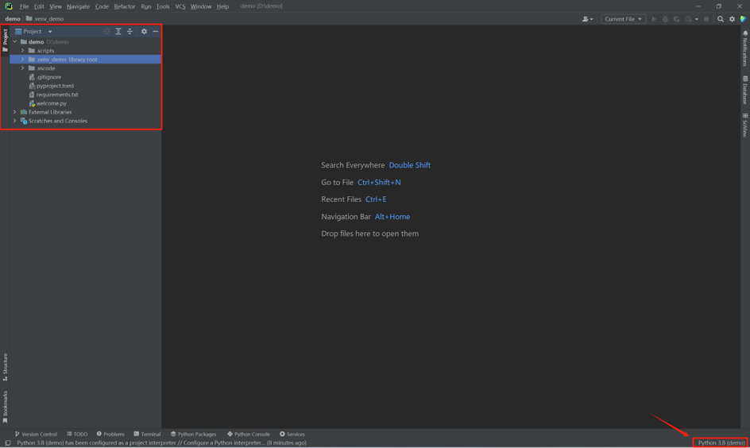

PhotoCAD
=======================================

This section demonstrates how to import the ZKTY PDK into **PhotoCAD**. It is divided into two steps: creating a PhotoCAD workspace and importing the ZKTY PDK. If a PhotoCAD workspace has already been created, the user can skip to step 2.

Create a PhotoCAD Workspace
*******************************************

Click on PhotoCAD to open the PhotoCAD Launcher in PIC Studio. Click ``IDE Config`` and select either ``Visual Studio Code`` or ``PyCharm`` as the IDE. Then click ``Create Workspace`` to configure the workspace.

Configure the workspace in the pop-up window.

* ``Workspace Template``

    * There are two options to choose from. ``Blank Workspace`` generates a cleaner package and ``Playground Workspace`` adds an extra example folder based on the first option.

* ``Workspace Parent Folder``

    * Select the workspace path.

* ``Workspace Name``

    * Define the name of the workspace.

* ``VirtualEnv Folder Name``

    * Specify the name of the virtual environment. We recommend that users do not change this setting. Use the default name or leave the .venv_ prefix and change only the suffix name.

* ``Python Version``

    * Select the Python version. We recommend that users select Python 3.8.

After the configuration, click ``Create and Open`` and the workspace will be automatically opened in the selected IDE. Based on the configuration in the figure above, a workspace named demo will be created and opened by PyCharm. On the left side you can see the workspace structure. Please make sure that the interpreter is the same as the configuration.

Double-click the ``welcome.py`` in demo the folder. Run this code by right-clicking on the code interface and selecting ``Run 'welcome'``.

The workspace has been created successfully if you see a pop-up window like the one shown below.

Import ZKTY PDK into PhotoCAD
*******************************************

First, make sure that the ZKTY PDK version matches the version of **PhotoCAD**. The version of **PhotoCAD** can be obtained in ``Run`` by running scripts in **PhotoCAD**.

Extract the ``ZKTY_PDK1.0_Latitudeda_Customer.zip`` archive and copy it to the workspace folder. As shown in the figure below, the ``ZKTY_PDK1p0_Latitudeda`` folder is in the demo folder and parallel to .vene_demo.

It's important to note that the PDK folder structure is the same as in the figure. Subfolders such as ``components`` and ``examples`` should be seen when expanding the ``ZKTY_PDK1p0_Latitudeda`` folder. Otherwise, the import path will be wrong when you run the code.

Open and run ``ZKTY_PDK1p0_Latitudeda/examples/link_test.py``. PDK will be imported successfully if there are no errors and ``link_test.gds`` will be exported.

